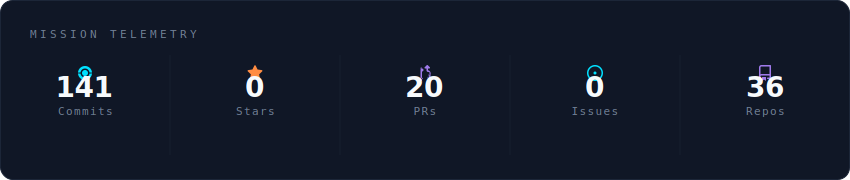

<!-- Galaxy Profile README
     Gerado automaticamente pelo galaxy-profile
     SVGs atualizados a cada 12 horas via GitHub Actions -->

  

 

  

 

  

 

  

 

<strong>Mais sobre mim</strong>

 

I build scalable digital ecosystems.
From high-performance APIs to DeFi platforms and automation systems,
I turn ideas into production-ready products.

**Atualmente em** AuraLabs — Brazil 🇧🇷

_"Consistency compounds. Build. Ship. Evolve."_

 

  
  
  

